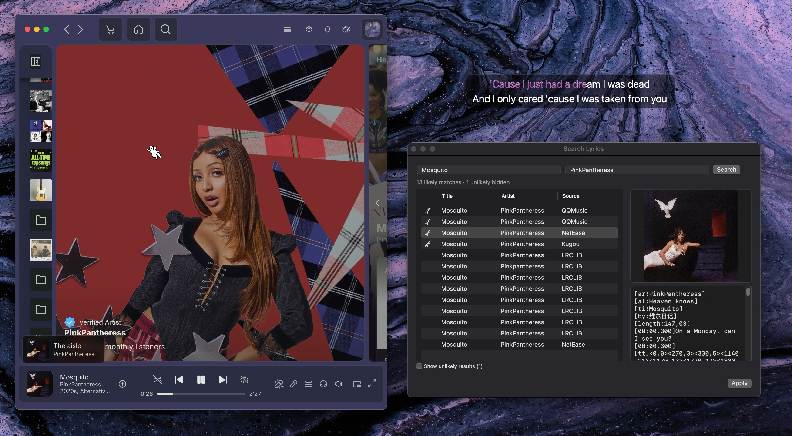

# Lirico


**Press play. The lyrics follow.**

Lirico automatically finds and displays beautifully synced lyrics for whatever's
playing on your Mac — right on your desktop and in your menu bar, in time with every line.

## What's different

Lirico changes how lyrics get picked. When a karaoke version exists that highlights each word as it's sung, that's
what you get instead of plain scrolling lyrics. Lirico also keeps looking for a beat after the first result, quietly
upgrading to a better match if one shows up, and it never replaces lyrics you've saved by hand.

## Installation

There's no packaged release yet, so build Lirico from source:

```bash
git clone https://github.com/fabiogaliano/Lirico.git
cd Lirico
make install-release
```

`make install-release` builds the optimized Release app and copies `Lirico.app` to `/Applications`. Or open `LyricsX.xcodeproj` in Xcode and press Cmd+R. See [Building from source](#building-from-source) for the development targets.

To use **Musixmatch** as a lyrics source, follow [these steps](https://gist.github.com/TrueMyst/0461aea999e347182486934fd83a4cf9) or [these](https://spicetify.app/docs/faq#sometimes-popup-lyrics-andor-lyrics-plus-seem-to-not-work) to obtain a **usertoken**, then add it in Lirico's preferences.

### Requirements

- macOS 15+
- Xcode 26+ (to build from source)

### Building from source

Builds default to the **Debug** configuration, which skips whole-module
optimization — a one-file change rebuilds in ~20s instead of ~85s. Debug
installs as `Lirico-Debug.app` (bundle id `dev.fabiogaliano.LyricsX`), so it
runs side-by-side with the real `Lirico.app` without conflict.

| Command | Configuration | What it does |
|---|---|---|
| `make build` | Debug | Fast (~20s) compile — the normal dev loop |
| `make install` | Debug | Build, copy `Lirico-Debug.app` to `/Applications`, relaunch — fast dev iteration |
| `make release` | Release | Optimized build — for distribution |
| `make install-release` | Release | Build, copy `Lirico.app` to `/Applications`, relaunch — final testing before shipping |

Run `make help` for the full list, or override the configuration on any target with `CONFIG=Release`.

### Diagnosing lyrics selection

To debug *why* a particular lyric was chosen for the playing song — all candidates, their ranks/scores, the auto-pick, and how their timing/metadata differ — run `scripts/lyrics-diag/diag.sh`. It reuses the app's real evaluator/ranker and your live settings. See [`scripts/lyrics-diag/README.md`](scripts/lyrics-diag/README.md).

## Features

- Works with your favorite music players. [List of supported players](https://github.com/MxIris-LyricsX-Project/MusicPlayer#supported-players)
- Automatically searches and downloads synced lyrics from multiple sources. [List of supported sources](https://github.com/MxIris-LyricsX-Project/LyricsKit#supported-sources)
- Always tries to match the song you're playing, not just pull from a favorite source.
- Prefers karaoke lyrics, where each word lights up as it's sung, and upgrades plain lyrics to karaoke when a good version appears. Lyrics you saved by hand are never overwritten.
- Displays lyrics on your desktop and in the menu bar, with customizable font, color, and position.
- Adjust lyric timing offset from the status menu.
- Jump to any point in a song by double-clicking a line.
- Drag and drop to import or export lyrics files.
- Steerable manual search: search by title, artist, or both, with wrong-song results filtered out, karaoke matches marked with a 🎤, a toggle to show unlikely results, and cancel support that keeps partial results.
- Launches and quits automatically with your music player.
- Converts automatically between Traditional and Simplified Chinese.

### Lyrics Editor

Lirico uses a custom lyrics file format, "LRCX", that supports word timing tags, translations in multiple languages, and more. Currently there's no official LRCX editor. You can use [Lrcx_Creator](https://github.com/Doublefire-Chen/Lrcx_Creator) for now (see [#544](https://github.com/ddddxxx/LyricsX/issues/544), thanks to [@Doublefire-Chen](https://github.com/Doublefire-Chen)). Or use a normal LRC editor, as LRCX is compatible with LRC.

## Screenshot




## Credit

Lirico is a fork of [LyricsX by the MxIris-LyricsX-Project](https://github.com/MxIris-LyricsX-Project/LyricsX),
which builds on the original [LyricsX by ddddxxx](https://github.com/ddddxxx/LyricsX). Deep thanks to both for the
foundation Lirico is built on.

#### Components

- [LyricsKit](https://github.com/MxIris-LyricsX-Project/LyricsKit)
- [MusicPlayer](https://github.com/MxIris-LyricsX-Project/MusicPlayer)

#### Open Source Libraries

- [SwiftyOpenCC](https://github.com/ddddxxx/SwiftyOpenCC)
- [GenericID](https://github.com/ddddxxx/GenericID)
- [SwiftCF](https://github.com/ddddxxx/SwiftCF)
- [Regex](https://github.com/ddddxxx/Regex)
- [Semver](https://github.com/ddddxxx/Semver)
- [TouchBarHelper](https://github.com/ddddxxx/TouchBarHelper)
- [CombineX](https://github.com/cx-org/CombineX)
- [SnapKit](https://github.com/SnapKit/SnapKit)
- [MASShortcut](https://github.com/shpakovski/MASShortcut)
- [Sparkle](https://github.com/sparkle-project/Sparkle)
- [Then](https://github.com/devxoul/Then)

#### Special Thanks

- [Lyrics Project](https://github.com/MichaelRow/Lyrics)


## ⚠️ Disclaimer

All lyrics are property and copyright of their owners.
