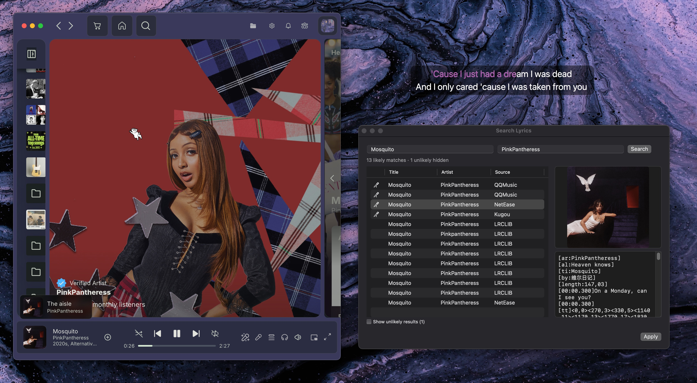
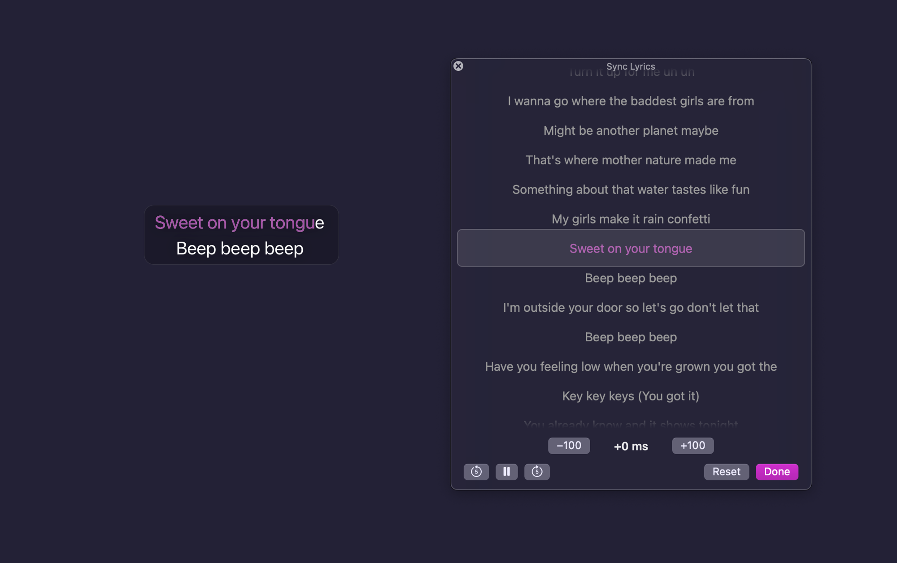

# Lirico



**Press play. The lyrics follow.**

Lirico automatically finds and displays synced lyrics for whatever's playing on your Mac.

## Installation

There's no packaged release yet, so build Lirico from source:

```bash
git clone https://github.com/fabiogaliano/Lirico.git
cd Lirico
make install-release
```

This builds the Release app and copies `Lirico.app` to `/Applications`. You can also open `Lirico.xcodeproj` in Xcode and press Cmd+R.

To use **Musixmatch** as a lyrics source, get a **usertoken** by following [these steps](https://gist.github.com/TrueMyst/0461aea999e347182486934fd83a4cf9) or [these](https://spicetify.app/docs/faq#sometimes-popup-lyrics-andor-lyrics-plus-seem-to-not-work), then add it in Lirico's settings.

### Requirements

- macOS 15+
- Xcode 26+ (to build from source)

### Building from source

Builds default to **Debug**, which rebuilds a one-file change in about 20s instead of 85s. Debug installs as
`Lirico-Debug.app` (bundle id `dev.fabiogaliano.Lirico`), so it runs side by side with `Lirico.app`.

| Command                | Configuration | What it does                                          |
| ---------------------- | ------------- | ----------------------------------------------------- |
| `make build`           | Debug         | Compile                                               |
| `make install`         | Debug         | Build, copy `Lirico-Debug.app` to `/Applications`, relaunch |
| `make release`         | Release       | Optimized build                                       |
| `make install-release` | Release       | Build, copy `Lirico.app` to `/Applications`, relaunch |

Run `make help` for the full list. Override the configuration on any target with `CONFIG=Release`.

### Diagnosing lyrics selection

To see why a lyric was chosen for the playing song (every candidate, its rank and score, and the automatic pick), run
`scripts/lyrics-diag/diag.sh`. It uses the app's own ranking and your settings. See [`scripts/lyrics-diag/README.md`](scripts/lyrics-diag/README.md).

## Features

- Works with your music players. [Supported players](https://github.com/MxIris-LyricsX-Project/MusicPlayer#supported-players)
- Searches and downloads synced lyrics from multiple sources. [Supported sources](https://github.com/MxIris-LyricsX-Project/LyricsKit#supported-sources)
- Matches the song you're playing rather than favoring one source.
- Prefers karaoke lyrics and upgrades plain lyrics when a good karaoke version appears.
- Shows lyrics on your desktop and in the menu bar, with your choice of font, color and position.
- Fix the timing by ear: open **Sync by Ear** and tap the line you hear.
- Adjust the timing offset from the status menu.
- Double-click a line to jump to it.
- Drop an `.lrc` file on the lyrics window to import it.
- Manual search by title, artist or both. Wrong-song results are filtered out, karaoke matches are marked with 🎤, and unlikely results are one toggle away.
- Opens and quits with your music player.
- Converts between Traditional and Simplified Chinese.

### Lyrics Editor

Lirico uses its own lyrics format, "LRCX", which supports word timing, translations in multiple languages and more.
There's no official LRCX editor yet. You can use [Lrcx_Creator](https://github.com/Doublefire-Chen/Lrcx_Creator) (see
[#544](https://github.com/ddddxxx/LyricsX/issues/544), thanks to [@Doublefire-Chen](https://github.com/Doublefire-Chen)),
or any LRC editor, since LRCX is compatible with LRC.

## Screenshot



## How it differs from LyricsX

- **Better picks.** It checks that lyrics are for your song, even when the title says "Remastered" or "Live", and prefers versions where each word lights up as it's sung.
- **It keeps looking.** If a better version turns up a few seconds later, it switches to it. Lyrics you saved yourself stay.
- **Timing by ear.** Instead of guessing milliseconds, tap the line you hear and everything lines up.
- **It tells you what's going on.** Searching, nothing found, lyrics turned off for this song, or missing permission to see your player.
- **It follows the player you're using.** Start music in another app and the lyrics follow; it opens and quits with any supported player.
- **Censored words filled in** (optional).

## Credit

Lirico is a fork of [LyricsX by the MxIris-LyricsX-Project](https://github.com/MxIris-LyricsX-Project/LyricsX),
which builds on the original [LyricsX by ddddxxx](https://github.com/ddddxxx/LyricsX). Thanks to both for the
foundation Lirico is built on.

#### Components

- [LyricsKit](https://github.com/fabiogaliano/LyricsKit) (MPL-2.0)
- [MusicPlayer](https://github.com/MxIris-LyricsX-Project/MusicPlayer) (MPL-2.0)

#### Open Source Libraries

- [SwiftyOpenCC](https://github.com/ddddxxx/SwiftyOpenCC) (MIT)
- [GenericID](https://github.com/MxIris-LyricsX-Project/GenericID) (MIT)
- [SwiftCF](https://github.com/MxIris-Library-Forks/SwiftCF) (MIT)
- [Regex](https://github.com/ddddxxx/Regex) (MIT)
- [SnapKit](https://github.com/SnapKit/SnapKit) (MIT)
- [MarqueeLabel](https://github.com/MxIris-LyricsX-Project/MarqueeLabel) (MIT)
- [BigInt](https://github.com/attaswift/BigInt) (MIT)
- [FrameworkToolbox](https://github.com/Mx-Iris/FrameworkToolbox) (MIT)
- [CombineX](https://github.com/cx-org/CombineX) (MIT, vendored)
- [Then](https://github.com/devxoul/Then) (MIT, vendored)
- [Swift Collections](https://github.com/apple/swift-collections) (Apache-2.0)
- [Swift Async Algorithms](https://github.com/apple/swift-async-algorithms) (Apache-2.0)
- [MASShortcut](https://github.com/shpakovski/MASShortcut) (BSD-2-Clause)
- [mediaremote-adapter](https://github.com/MxIris-LyricsX-Project/mediaremote-adapter) (BSD-3-Clause)
- [CryptoSwift](https://github.com/krzyzanowskim/CryptoSwift) (custom, attribution; see [NOTICE](NOTICE))

This product includes software developed by Marcin Krzyżanowski (http://krzyzanowskim.com/).
See [NOTICE](NOTICE) for the full third-party attributions and license notices.

#### Special Thanks

- [Lyrics Project](https://github.com/MichaelRow/Lyrics)

## ⚠️ Disclaimer

All lyrics are property and copyright of their owners.
